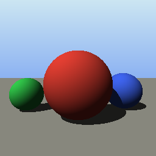

# gax-blend

A geometric algebra library for [Bend 2](https://github.com/bendlang/bend):
fast on Bend's CPU and GPU backends, with its algebra proven in Bend's own
type theory instead of tested. gax ([github.com/jobstijl/gax](https://github.com/jobstijl/gax))
is the semantic reference.

## Status

| layer | what | state |
|---|---|---|
| S, the spec | a multivector tree over any dimension, any diagonal signature, any scalar ring | **24 laws proven** ([docs/laws.md](docs/laws.md)); `LAWS.bend` approved |
| K, kernels | flat per-kind records with straight-line kernels, each proven equal to the spec | **generated** for VGA2D, VGA3D, PGA2D, PGA3D, STA, STAP, CGA3D and CSTA (the last two in gax's null basis, through a proven change of basis): 7501 kernels; all proven except CSTA's, whose proofs are generated but not yet checked in full (about 10 h; `algebras/`) |
| A, the API | PGA2D/3D, VGA3D, CGA3D, STA with geometric nouns and batch APIs | PGA3D (`api/pga3d.bend`): constructors, exp/log, normalize, sqrt, motions between elements; CGA3D (`api/cga3d.bend`): points, spheres, planes, motions; VGA3D rotors and PGA2D motions (`api/vga3d.bend`, `api/pga2d.bend`) |
| rounding error | one theorem for every term, with and without underflow, and per kernel a law that each output is within h(k)·(kernel on \|inputs\|) of exact | **proven** (`proofs/err.bend`, `algebras/*/err.bend`: 7189 kernel laws, all checked); F32 measured within the bound ([docs/numerics.md](docs/numerics.md)) |
| numbers | exact `Int`, proven an ordered commutative ring (`proofs/int.bend`); double-F32 (`num/df32.bend`, reference arithmetic); dyadics, SoftF32, posits | Phase 3 |

The Phase 0 measurements behind the design (checker cost, kernel speed
against C, GPU) are in [docs/bend-facts.md](docs/bend-facts.md), and the
decisions in [docs/design.md](docs/design.md).

## Running it

```sh
. tools/env.sh          # bend 2.0.35 and the project's clang on PATH
tools/gate.sh           # proofs, generated kernels and their error laws, example tests, negative controls (CGA3D's proofs skipped; about 8 min)
tools/gate.sh --full    # also CGA3D's kernel proofs (about an hour)
tools/gate.sh --csta    # also CSTA's (estimated 10 hours; not yet run)
tools/regen.sh          # regenerate algebras/ from gen/specs.bend (--check: compare)
bend tests/spec_pga3d.bend
```

`tools/gate.sh` passes only when:
- `bend PROOF.bend` prints ALL PROOFS CHECK;
- `algebras/` and the generated `proofs/` modules are what the generators
  write (`tools/regen.sh --check`);
- every `algebras/*/proofs.bend` and `algebras/*/f32.bend` checks;
- every `tests/*.bend` and `examples/*.bend` prints the `#|` lines it ends with;
- every negative control in `tests/neg/` fails.

## Using it

`examples/motion.bend` (checked by the gate), PGA3D at F32:

```bend
# A quarter turn about the x axis, then a translation by 2 along z, applied
# to the point (0, 1, 0): it lands on (0, 0, 3).
import Base
import ../api/pga3d.bend as P
import ../api/normed.bend as U
import ../algebras/pga3d/kinds.bend as K
import ../algebras/pga3d/f32.bend as G

def x_axis() -> K.Line<F32>:
  G.Point.vee.Point(P.Point.xyz(0.0, 0.0, 0.0), P.Point.xyz(1.0, 0.0, 0.0))

def moved(p: K.Point<F32>) -> K.Point<F32>:
  +m = P.Motor.then(P.Motor.rotation(x_axis(), (F32.pi() * 0.5 : F32)), P.Motor.translation(0.0, 0.0, 2.0))
  G.Motor.transform.Point(U.Normed.get(K.Motor<F32>, m), p)

def r4(x: F32) -> String:
  F32.show((F32.round((x * 10000.0 : F32)) / 10000.0 : F32))

def Point.show(p: K.Point<F32>) -> String:
  match p:
    case K.Point{x, y, z, +w}:
      "(" ++ r4((x / w : F32)) ++ ", " ++ r4((y / w : F32)) ++ ", " ++ r4((z / w : F32)) ++ ")"

def main() -> IO(Unit):
  IO.print(Point.show(moved(P.Point.xyz(0.0, 1.0, 0.0))))
```

The kinds module (`K`) holds the geometric nouns (`Point`, `Line`,
`Plane`, `Motor`, ...). Every product is a generated kernel named by its
operands (`G.Point.vee.Point`, `G.Motor.transform.Point`,
`G.Line.lc.Plane`), so a product that does not exist is a missing name. The
API (`P`) adds the constructors and numerics.

## Demo

`demos/raytrace.bend` ray-traces three balls on a floor in CGA3D: each ray
is the line through the eye and a pixel's point, meets a sphere in a point
pair and the floor in a flat point, and is shaded by a dot product of
directions, with shadow rays. It renders into Bend's quadtree `Image`, one
fork per quadrant, and writes a PPM:

```sh
bend demos/raytrace.bend -o build/rt && build/rt build/raytrace.ppm   # 256x256, ~30 ms
```



What the library gained so that the demo needs no raw square roots or
coordinate arithmetic is in [docs/friction.md](docs/friction.md).
`tests/raytrace_pixels.bend` checks four of its pixels.

GPU runs use the upstream `hip` branch: `. tools/env-hip.sh`, then `bend-hip`.
See bend-facts, "Pins".

## Layout

```
LAWS.bend         the laws (owned by the human once approved)
PROOF.bend        fills every law; the gate
src/spec.bend     Layer S: MV(T, d), Sig(d), products, signs, complements, grades
src/ring.bend     the ring laws a theorem may assume
src/int.bend      exact integers
src/show.bend     printing multivectors as blade sums
src/expr.bend     the symbolic ring the generator runs Layer S on
src/err.bend      the rounding-error model: computed operations, absev, k, h
num/              number types (double-F32)
gen/              the kernel generator (Bend): specs, symbolic evaluation, printers
gen/proofs/       the proof writer (Bend): emits the large Layer-S proof modules
algebras/         generated: kinds, kernels, proofs, error laws, F32 module per algebra
api/              Layer A: per-algebra API at F32 (pga3d, pga2d, vga3d, cga3d), Study functions, Normed
proofs/           the lemmas behind PROOF.bend (base, leaf, add, sgn by hand;
                  the rest generated by gen/proofs), and the Nat and Int laws
tests/            example tests (`#|` expected output) and negative controls
bench/            benchmarks (Bend against C) and rounding-error measurements
examples/         small programs using the API, checked by the gate
demos/            the CGA3D ray tracer (Phase 4 demo)
spikes/           Phase 0 experiments, kept as evidence for bend-facts
tools/            env, the 16 GB cap, the gate
docs/             facts, design (ADRs), laws, upstream notes
```

## Conventions

Basis, orientation and signs follow gax (ADR-009 there):
- PGA puts e0 first;
- the join sign is e123 ∨ e032 = +e23;
- `J_R` is the right complement, with a ∧ J_R(a) = I;
- the regressive product is J_L(J_R a ∧ J_R b).
